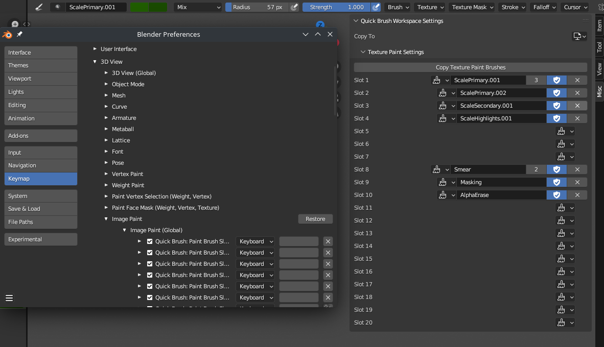

# Quick Brush

Adds hotkey support for individual brushes:

* Brushes are mapped into slots
* Slots can be hot-keyed
* Brush mappings are **PER WORKSPACE** (copy-to-workspace button is provided)

Notes:

* Supported Blender version: `3.4.0`
* By default, the addon creates 20 slots but can be manually increased by editing `SLOT_COUNT` in `constants.py`
* Currently only supports *image painting brushes* but can easily be extended to other kinds
  * Hotkeys can be found at `3D View > Image Paint > Image Paint (Global)` (prefixed with `Quick Brush`)

